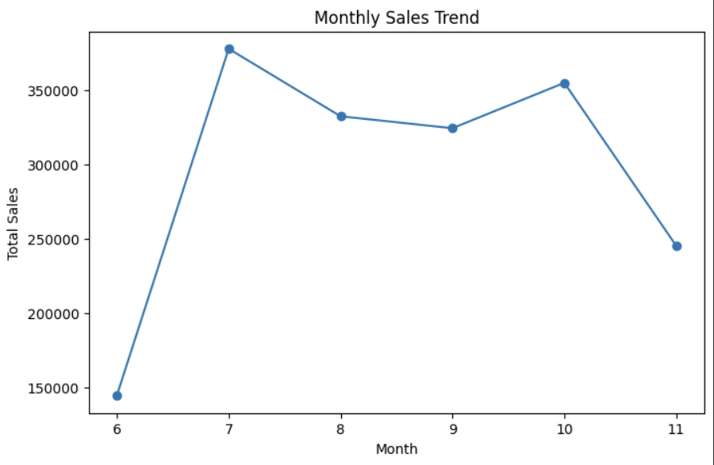
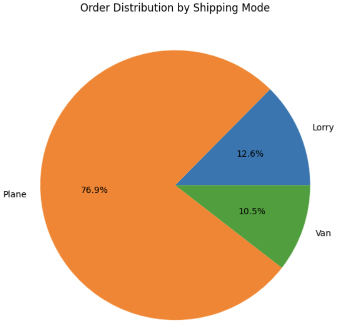
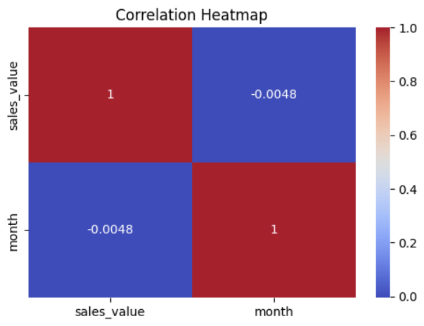

# Sales Data Analytics and Business Insights Using Python

## Project Overview

This project demonstrates a complete data analytics workflow using Python. The objective was to clean, transform, analyze, and visualize sales data to generate actionable business insights.

## Dataset

The dataset contains sales transaction records including customer information, product categories, order details, revenue, profit, and shipping information. The data was analyzed to identify trends, patterns, and business opportunities.

## Technologies Used

* Python
* Pandas
* NumPy
* Matplotlib

## Key Skills Demonstrated

* Data Cleaning
* Data Transformation
* Exploratory Data Analysis (EDA)
* Feature Engineering
* Statistical Analysis
* Data Visualization
* Business Intelligence

## Project Tasks

* Cleaned and prepared raw sales data
* Handled missing values and inconsistencies
* Performed exploratory data analysis
* Identified sales trends and customer behavior patterns
* Created visualizations to communicate findings
* Generated business recommendations based on analytical insights

## Key Findings

- Identified top-performing product categories.
- Analyzed customer purchasing behavior.
- Evaluated shipping performance and delivery trends.
- Detected revenue and profit patterns across sales records.
- Generated recommendations to support business decision-making.

## Key Visualizations

### Monthly Sales Trend

### Sales by Salesperson

### Sales by Priority

### Shipping Mode Distribution

### Correlation Heatmap

## Files

* `report.pdf` – Complete project report and analysis

## Learning Outcomes

This project strengthened my practical skills in Python-based data analytics, statistical reasoning, and business-oriented decision making.
